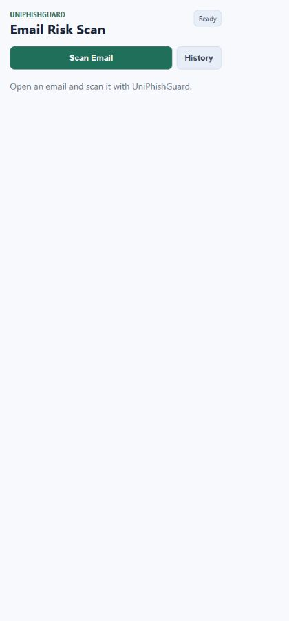
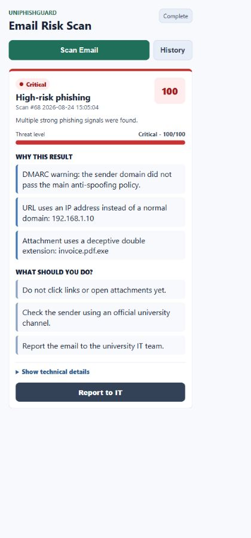
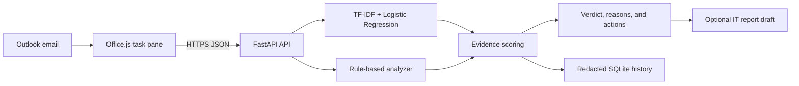

<div align="center">
  
  <h1>UniPhishGuard</h1>
  <p><strong>AI and rule-based phishing detection for Microsoft Outlook.</strong></p>
  <p>
    UniPhishGuard helps university students and staff assess suspicious email using an
    explainable text model, sender-authentication checks, link and attachment analysis,
    and university-impersonation rules.
  </p>

  <a href="https://github.com/rama-abuawad/UniPhishGuard/actions/workflows/quality.yml"></a>
  
  
  
</div>

## Overview

UniPhishGuard is an Outlook task-pane add-in that evaluates the email currently open in Outlook and returns a risk score, a clear verdict, the strongest reasons behind that verdict, and practical next steps. It combines two complementary approaches:

- **Machine learning:** word and character TF-IDF features with calibrated Logistic Regression identify text patterns learned from labelled legitimate and phishing email.
- **Security rules:** deterministic checks examine sender identity, Reply-To mismatches, SPF/DKIM/DMARC results, suspicious URLs, attachments, QR codes, and university impersonation.

The add-in supports human review; it does not automatically send reports, delete messages, quarantine email, or retrain from user data.

## Screenshots

<table>
  <tr>
    <td align="center"><strong>Ready to scan</strong></td>
    <td align="center"><strong>Explained high-risk result</strong></td>
  </tr>
  <tr>
    <td></td>
    <td></td>
  </tr>
</table>

The result view prioritizes the most useful evidence. Expanded technical details show risk impact by category, detected attack types, email-header issues, and other important findings.

## Key capabilities

- Scan the active Outlook email through Office.js.
- Estimate phishing probability using an explainable TF-IDF and Logistic Regression pipeline.
- Validate SPF, DKIM, DMARC, sender alignment, and trusted authentication results.
- Detect Reply-To mismatches and university-domain impersonation.
- Inspect misleading links, IP-address URLs, punycode, shorteners, encoded URLs, and unusual ports.
- Flag dangerous, double-extension, macro-enabled, MIME-mismatched, and archive attachments.
- Inspect bounded attachment content for ZIP entries, QR links, and SHA-256 hashes when Outlook exposes it.
- Store a limited, redacted, per-user scan history in SQLite.
- Open a pre-filled Outlook draft for reporting to IT; nothing is sent automatically.

## Architecture



### Scan flow

1. The Outlook add-in collects the subject, sender, Reply-To, body, available internet headers, links, and attachment metadata.
2. FastAPI validates the request and passes it to the analyzer.
3. The text model estimates how closely the message resembles labelled phishing email.
4. Security rules inspect concrete technical and social-engineering indicators.
5. Category caps combine corroborating evidence into a risk score from 0 to 100.
6. The add-in displays the verdict, strongest reasons, recommended actions, and optional technical details.
7. A redacted result is added to the user's limited scan history.

## Technology stack

| Layer | Technologies |
| --- | --- |
| Outlook add-in | HTML, CSS, JavaScript, Office.js |
| API | Python, FastAPI, Uvicorn, Pydantic |
| Machine learning | scikit-learn, TF-IDF, calibrated Logistic Regression, joblib |
| Rule analysis | Python, email-authentication parsing, URL and attachment heuristics |
| Attachment inspection | OpenCV headless for QR decoding, Python ZIP inspection, SHA-256 hashing |
| Storage | SQLite |
| Quality | pytest, Node.js test runner, Office manifest validator, GitHub Actions |

## Project structure

```text
backend/
  app/
    main.py                 FastAPI routes, authentication, CORS, and rate limits
    schemas.py              Pydantic request and response schemas
    analyzer.py             Rules, evidence scoring, and recommendations
    ai.py                   Model integrity checks and inference
    config.py               Validated organization and scoring configuration
    db.py                   Privacy-aware SQLite scan history
    settings.json           Trust, scoring, and organization settings
    email_model.joblib      Trained model artifact
    model_integrity.json    Trusted artifact checksums
    model_metrics.json      Saved evaluation evidence
  data/
    training_dataset.csv    Prepared, attributed training dataset
    DATASET_CARD.md         Provenance, splits, metrics, and limitations
  demo/                     Controlled manual-test scenarios and safe assets
  tests/                    Backend unit, security, and integration tests
  prepare_training_data.py  Dataset parsing, sanitization, and splitting
  train_model.py            Model training, calibration, and evaluation
  evaluate_external.py      Evaluation on a separate labelled CSV
outlook-addin/
  manifest.xml              Outlook add-in manifest
  taskpane.html             Task-pane structure
  taskpane.css              Task-pane presentation
  taskpane.js               Office.js integration, API calls, and rendering
  taskpane-utils.js         Pure reporting and formatting helpers
  assets/                   Outlook add-in icons
docs/images/                README screenshots
```

## Local development

### Prerequisites

- Python 3.14
- Node.js 22 or a compatible current release
- npm
- Classic Outlook for Windows with add-in sideloading available

The saved model was trained with Python 3.14.3, scikit-learn 1.9.0, and joblib 1.5.3. The model-runtime packages are pinned for artifact compatibility.

### 1. Install dependencies and the development certificate

Open **Command Prompt** in the repository root:

```bat
cd outlook-addin
npm install
npm run certs
npm run validate

cd ..\backend
python -m pip install -r requirements-dev.txt
```

Accept the certificate trust prompt if Windows displays one.

### 2. Start the HTTPS backend

From the repository root, open a new Command Prompt window:

```bat
cd backend
python -m uvicorn app.main:app --host localhost --port 8000 --ssl-certfile "%USERPROFILE%\.office-addin-dev-certs\localhost.crt" --ssl-keyfile "%USERPROFILE%\.office-addin-dev-certs\localhost.key"
```

Keep the window open and verify the service at [https://localhost:8000/health](https://localhost:8000/health).

FastAPI serves both the API and the add-in files under `/addin`, so a separate frontend server is not required.

### 3. Sideload the Outlook add-in

Open another Command Prompt window from the repository root:

```bat
cd outlook-addin
npm run validate
npm run sideload
```

Open an email in classic Outlook, open **UniPhishGuard**, and select **Scan Email**.

Stop the sideloaded session when finished:

```bat
cd outlook-addin
npm run stop
```

If port `8000` is already in use, close the older backend window before restarting. Do not change the port unless the URLs in `outlook-addin/manifest.xml` are updated to match.

## Configuration

Copy `backend/.env.example` to `backend/.env` for local environment settings. Organization domains, approved domains, trusted authentication servers, and evidence weights are defined in `backend/app/settings.json`.

Important production settings include:

- restrictive allowed origins;
- Microsoft Entra tenant and client identifiers;
- a strong history-HMAC secret;
- approved proxy-header behavior;
- request, rate, and history-retention limits.

Never place secrets in frontend JavaScript or commit `.env` files. Development authentication is intended only for local demonstrations. Production mode requires validated Microsoft Entra tokens and fails closed when required authentication configuration is missing.

## API

| Method | Endpoint | Purpose |
| --- | --- | --- |
| `GET` | `/health`, `/health/live`, `/health/ready` | Service health and readiness |
| `POST` | `/api/v1/analyze-email` | Analyze an email and store its redacted result |
| `GET` | `/api/v1/history` | Return recent scans for the authenticated user |
| `DELETE` | `/api/v1/history` | Clear the authenticated user's history |

Interactive API documentation is available at `/docs` in development. Legacy `/analyze-email` and `/history` aliases remain for add-in compatibility.

## Model and dataset

The saved English-language model uses word and character TF-IDF features with calibrated Logistic Regression. `backend/data/training_dataset.csv` contains **25,821** prepared records:

- 24,231 legitimate messages;
- 1,590 phishing messages;
- 18,462 training records;
- 3,547 validation records;
- 3,812 testing records.

Related template groups remain in a single partition, and Nazario 2025 phishing messages are reserved for the test split. URLs, email addresses, and IP addresses are normalized before storage and inference. Ordinary spam is excluded rather than labelled as phishing.

### Saved text-model evaluation

| Metric | Held-out result |
| --- | ---: |
| Accuracy | 98.03% |
| Phishing precision | 98.69% |
| Phishing recall | 84.30% |
| Phishing F1 | 90.93% |
| False-positive rate | 0.15% — 5 of 3,366 legitimate messages |
| False-negative rate | 15.70% — 70 of 446 phishing messages |

These are internal, source-aware **text-model** results, not guaranteed real-world or end-to-end detector performance. The rule analyzer provides additional evidence that the text model cannot verify. Full provenance, licences, preparation decisions, splits, and limitations are documented in [`backend/data/DATASET_CARD.md`](backend/data/DATASET_CARD.md).

### Train the model

```bat
cd backend
python train_model.py
```

Training verifies declared splits and group leakage, calibrates the classifier with group-aware folds, selects the operating point on validation data, evaluates the untouched test set, and publishes the model, metrics, and integrity hashes together.

Evaluate a separate labelled CSV without adding it to training:

```bat
cd backend
python evaluate_external.py path\to\external.csv --output external_evaluation_metrics.json
```

The external CSV must contain `label` and `text` columns.

## Rule-based analysis

The deterministic analyzer covers:

- sender and Reply-To domain mismatches;
- SPF, DKIM, DMARC, alignment, forwarding, ARC context, and missing headers;
- link-text mismatches, unusual domains, IP-address URLs, punycode, shorteners, encoding, and unusual ports;
- dangerous extensions, double extensions, macro-enabled files, MIME mismatches, ZIP contents, and QR links;
- university-domain lookalikes, untrusted university branding, and fake campus services.

Authentication results are trusted only when their `authserv-id` matches configured trusted servers. Missing or untrusted headers are shown as unavailable or suspicious—not as proof that authentication passed.

URL checks are heuristic. UniPhishGuard does not claim live domain reputation and does not send URLs or email content to an external reputation provider.

## Privacy and safety

- SQLite stores only a redacted subject, pseudonymized sender, score, verdict, and scan time.
- Full bodies, headers, attachment contents, tokens, credentials, and raw sender addresses are not stored in history.
- History is scoped per user and bounded by age and item-count limits.
- **Report to IT** opens a draft; the user reviews, addresses, and sends it manually.
- The add-in does not delete, quarantine, forward, or automatically learn from scanned email.
- Model artifacts are verified against committed SHA-256 hashes before loading.

Email content still travels between the add-in and its API. A production deployment must use HTTPS, restrictive CORS, authentication, protected logs, rate limiting, and an approved retention policy.

## Testing

Run the complete local quality checks:

```bat
cd backend
python -m pytest -q
python -m compileall -q app tests train_model.py prepare_training_data.py evaluate_external.py

cd ..\outlook-addin
node --check taskpane.js
npm test
npm run validate
```

The GitHub Actions quality gate runs backend tests and integrity checks, frontend tests, Python syntax checks, and Outlook manifest validation on every push and pull request. Manual Outlook testing remains necessary for Office.js host behavior.

Safe demonstration scenarios and generated attachments are available in [`backend/demo/`](backend/demo/README.md).

## Deployment notes

Generate production frontend configuration and a production manifest without editing application logic:

```bat
cd outlook-addin
npm run configure:production -- --app-url https://addin.example.edu --api-url https://api.example.edu
```

This creates `dist/manifest.xml` and `dist/config.js`. Replace example origins with approved HTTPS services, configure Microsoft Entra, validate the generated manifest, and distribute it through the university's Microsoft 365 administration workflow.

`render.yaml` describes the FastAPI service. The included process-local rate limiter is appropriate for a local demonstration; multi-instance production deployment requires a shared limiter such as Redis.

## Current limitations

- The model is primarily English and has not been evaluated for Arabic or mixed Arabic-English email.
- Public research corpora may contain historical bias or labelling errors.
- Some Outlook clients do not expose internet headers or attachment bytes; the UI reports these capabilities as unavailable.
- URL rules identify suspicious structure but do not provide live reputation results.
- No detector can guarantee zero false positives or zero false negatives.

UniPhishGuard should support user and IT review alongside—not replace—the university secure email gateway and incident-response process.
