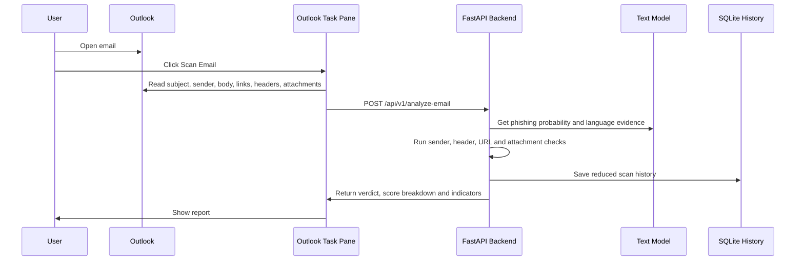

# UniPhishGuard Architecture

UniPhishGuard is a hybrid AI-assisted phishing detector.

## Components

- Outlook task pane: collects email metadata and renders the report.
- FastAPI backend: validates requests, runs analysis and returns structured results.
- Rule engine: checks sender identity, authentication headers, URLs and attachments.
- ML model: TF-IDF word/character features with calibrated Logistic Regression.
- SQLite history: stores reduced metadata only, separated by user.

## Data Flow

The task pane sends email metadata, body text, links, headers and attachment metadata to the configured backend. The backend does not execute attachments. History stores subject, pseudonymized sender, verdict, score and indicator count.

## Current Limitation

The local demo runs on a developer machine with local HTTPS certificates. Production requires Microsoft Entra app registration, admin consent, hosted HTTPS URLs and ADU-approved retention/reporting rules.
